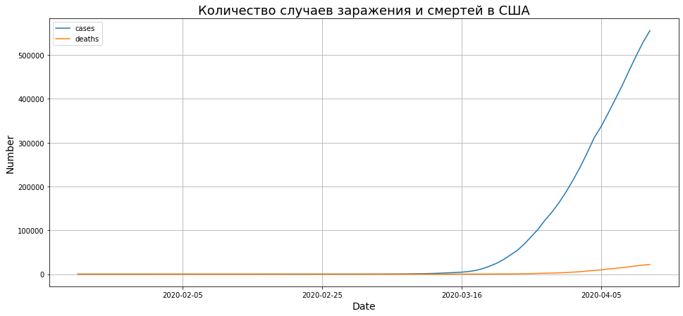
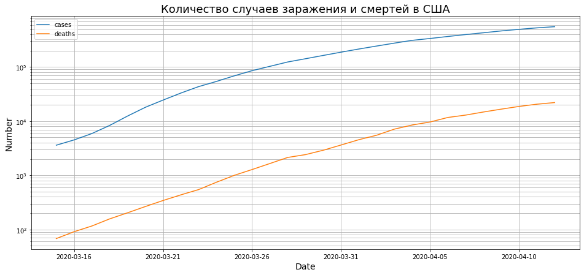
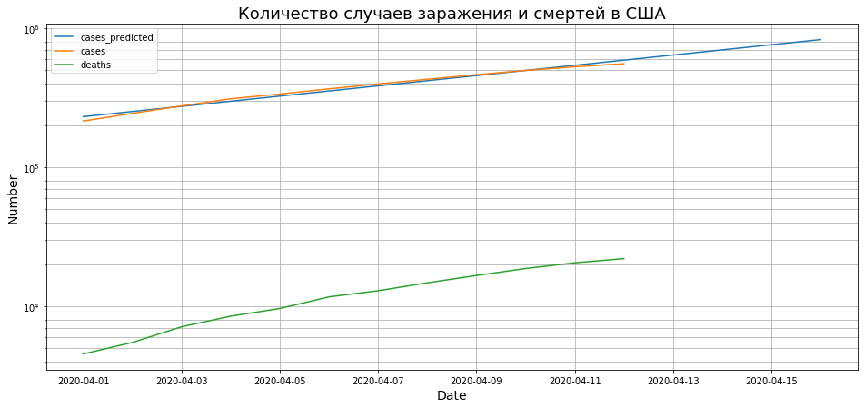
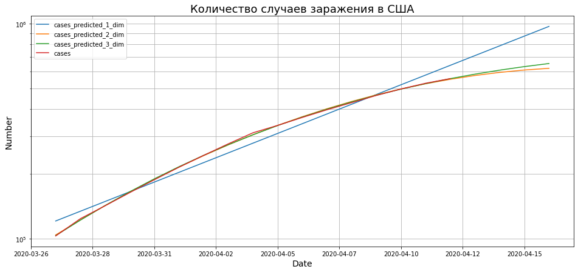

Этот ноутбук посвящен вступительному заданию на кафедру корпоративных систем ФПМИ МФТИ.
Цель - предсказать количество заболевших вирусом SARS-CoV-2 на территории США на 16.04.2020 на основании данных по 12.04.2020. Данные взяты [здесь](https://github.com/nytimes/covid-19-data) (данные The New York Times). Ссылки оттуда лучше открывать под американским впн, а то американцы, кажется, не любят русским данные давать:)


```python
import pandas as pd
import matplotlib.pyplot as plt
import scipy as sp
import numpy as np
from matplotlib.dates import date2num, DateFormatter
%matplotlib inline
```

Загрузим датасет


```python
covid = pd.read_csv('us-counties.csv', index_col='date')
```


```python
covid.head(10)
```


<div>
<style scoped>
    .dataframe tbody tr th:only-of-type {
        vertical-align: middle;
    }

    .dataframe tbody tr th {
        vertical-align: top;
    }

    .dataframe thead th {
        text-align: right;
    }
</style>
<table border="1" class="dataframe">
  <thead>
    <tr style="text-align: right;">
      <th></th>
      <th>county</th>
      <th>state</th>
      <th>fips</th>
      <th>cases</th>
      <th>deaths</th>
    </tr>
    <tr>
      <th>date</th>
      <th></th>
      <th></th>
      <th></th>
      <th></th>
      <th></th>
    </tr>
  </thead>
  <tbody>
    <tr>
      <th>2020-01-21</th>
      <td>Snohomish</td>
      <td>Washington</td>
      <td>53061.0</td>
      <td>1</td>
      <td>0</td>
    </tr>
    <tr>
      <th>2020-01-22</th>
      <td>Snohomish</td>
      <td>Washington</td>
      <td>53061.0</td>
      <td>1</td>
      <td>0</td>
    </tr>
    <tr>
      <th>2020-01-23</th>
      <td>Snohomish</td>
      <td>Washington</td>
      <td>53061.0</td>
      <td>1</td>
      <td>0</td>
    </tr>
    <tr>
      <th>2020-01-24</th>
      <td>Cook</td>
      <td>Illinois</td>
      <td>17031.0</td>
      <td>1</td>
      <td>0</td>
    </tr>
    <tr>
      <th>2020-01-24</th>
      <td>Snohomish</td>
      <td>Washington</td>
      <td>53061.0</td>
      <td>1</td>
      <td>0</td>
    </tr>
    <tr>
      <th>2020-01-25</th>
      <td>Orange</td>
      <td>California</td>
      <td>6059.0</td>
      <td>1</td>
      <td>0</td>
    </tr>
    <tr>
      <th>2020-01-25</th>
      <td>Cook</td>
      <td>Illinois</td>
      <td>17031.0</td>
      <td>1</td>
      <td>0</td>
    </tr>
    <tr>
      <th>2020-01-25</th>
      <td>Snohomish</td>
      <td>Washington</td>
      <td>53061.0</td>
      <td>1</td>
      <td>0</td>
    </tr>
    <tr>
      <th>2020-01-26</th>
      <td>Maricopa</td>
      <td>Arizona</td>
      <td>4013.0</td>
      <td>1</td>
      <td>0</td>
    </tr>
    <tr>
      <th>2020-01-26</th>
      <td>Los Angeles</td>
      <td>California</td>
      <td>6037.0</td>
      <td>1</td>
      <td>0</td>
    </tr>
  </tbody>
</table>
</div>


Ага, у нас есть данные по городам и штатам. Но для начала попробуем проанализировать данные заболевших и смертей суммарно по всей стране


```python
covid_total = covid.groupby('date').sum()
```


```python
covid_total.tail(10)
```


<div>
<style scoped>
    .dataframe tbody tr th:only-of-type {
        vertical-align: middle;
    }

    .dataframe tbody tr th {
        vertical-align: top;
    }

    .dataframe thead th {
        text-align: right;
    }
</style>
<table border="1" class="dataframe">
  <thead>
    <tr style="text-align: right;">
      <th></th>
      <th>fips</th>
      <th>cases</th>
      <th>deaths</th>
    </tr>
    <tr>
      <th>date</th>
      <th></th>
      <th></th>
      <th></th>
    </tr>
  </thead>
  <tbody>
    <tr>
      <th>2020-04-03</th>
      <td>69388023.0</td>
      <td>276201</td>
      <td>7136</td>
    </tr>
    <tr>
      <th>2020-04-04</th>
      <td>70752270.0</td>
      <td>310842</td>
      <td>8505</td>
    </tr>
    <tr>
      <th>2020-04-05</th>
      <td>71835852.0</td>
      <td>336410</td>
      <td>9661</td>
    </tr>
    <tr>
      <th>2020-04-06</th>
      <td>73133230.0</td>
      <td>366362</td>
      <td>11709</td>
    </tr>
    <tr>
      <th>2020-04-07</th>
      <td>74975534.0</td>
      <td>397752</td>
      <td>12959</td>
    </tr>
    <tr>
      <th>2020-04-08</th>
      <td>75907246.0</td>
      <td>429283</td>
      <td>14779</td>
    </tr>
    <tr>
      <th>2020-04-09</th>
      <td>76939136.0</td>
      <td>463689</td>
      <td>16685</td>
    </tr>
    <tr>
      <th>2020-04-10</th>
      <td>78022155.0</td>
      <td>496904</td>
      <td>18720</td>
    </tr>
    <tr>
      <th>2020-04-11</th>
      <td>78961112.0</td>
      <td>528422</td>
      <td>20579</td>
    </tr>
    <tr>
      <th>2020-04-12</th>
      <td>79546102.0</td>
      <td>555374</td>
      <td>22058</td>
    </tr>
  </tbody>
</table>
</div>


Ну что, построим графики. Сначала для всего отрезка, а там видно будет


```python
fig, ax = plt.subplots(figsize=(16, 7))
ax.xaxis.set_major_formatter(DateFormatter('%Y-%m-%d'))
ax.set_title('Количество случаев заражения и смертей в США', fontdict={'size': 18})
ax.set_ylabel('Number', fontdict={'size': 14})
ax.set_xlabel('Date', fontdict={'size': 14})
ax.plot(date2num(pd.to_datetime(covid_total.index).to_pydatetime()), covid_total.cases, label='cases')
ax.plot(date2num(pd.to_datetime(covid_total.index).to_pydatetime()), covid_total.deaths, label='deaths')
ax.legend(loc='best')
plt.grid(which='both')
plt.show()
```





Что-то не очень показательно. Видно, что что-то похожее на экспоненту, но не более того. Давайте в логарифмическом масштабе где-нибудь с середины марта смотреть.


```python
covid_total_march = covid_total['2020-03-15':]
```


```python
fig, ax = plt.subplots(figsize=(16, 7))
ax.xaxis.set_major_formatter(DateFormatter('%Y-%m-%d'))
ax.set_title('Количество случаев заражения и смертей в США', fontdict={'size': 18})
ax.set_ylabel('Number', fontdict={'size': 14})
ax.set_xlabel('Date', fontdict={'size': 14})
plt.yscale('log')
ax.plot(date2num(pd.to_datetime(covid_total_march.index).to_pydatetime()),
        covid_total_march.cases, label='cases')
ax.plot(date2num(pd.to_datetime(covid_total_march.index).to_pydatetime()),
        covid_total_march.deaths, label='deaths')
ax.legend(loc='best')
plt.grid(which='both')
plt.show()
```





Видно, что показатель экспоненты постепенно уменьшается, но достаточно медленно. Давайте попробуем взять данные только за апрель, усредним показатель экспоненты и попробуем предсказать на основании этого показателя. Тогда должно получиться число не меньше реального.


```python
covid_total_april = covid_total['2020-04-01':]
```


```python
covid_total_april
```


<div>
<style scoped>
    .dataframe tbody tr th:only-of-type {
        vertical-align: middle;
    }

    .dataframe tbody tr th {
        vertical-align: top;
    }

    .dataframe thead th {
        text-align: right;
    }
</style>
<table border="1" class="dataframe">
  <thead>
    <tr style="text-align: right;">
      <th></th>
      <th>fips</th>
      <th>cases</th>
      <th>deaths</th>
    </tr>
    <tr>
      <th>date</th>
      <th></th>
      <th></th>
      <th></th>
    </tr>
  </thead>
  <tbody>
    <tr>
      <th>2020-04-01</th>
      <td>65474284.0</td>
      <td>215013</td>
      <td>4551</td>
    </tr>
    <tr>
      <th>2020-04-02</th>
      <td>67381553.0</td>
      <td>244007</td>
      <td>5502</td>
    </tr>
    <tr>
      <th>2020-04-03</th>
      <td>69388023.0</td>
      <td>276201</td>
      <td>7136</td>
    </tr>
    <tr>
      <th>2020-04-04</th>
      <td>70752270.0</td>
      <td>310842</td>
      <td>8505</td>
    </tr>
    <tr>
      <th>2020-04-05</th>
      <td>71835852.0</td>
      <td>336410</td>
      <td>9661</td>
    </tr>
    <tr>
      <th>2020-04-06</th>
      <td>73133230.0</td>
      <td>366362</td>
      <td>11709</td>
    </tr>
    <tr>
      <th>2020-04-07</th>
      <td>74975534.0</td>
      <td>397752</td>
      <td>12959</td>
    </tr>
    <tr>
      <th>2020-04-08</th>
      <td>75907246.0</td>
      <td>429283</td>
      <td>14779</td>
    </tr>
    <tr>
      <th>2020-04-09</th>
      <td>76939136.0</td>
      <td>463689</td>
      <td>16685</td>
    </tr>
    <tr>
      <th>2020-04-10</th>
      <td>78022155.0</td>
      <td>496904</td>
      <td>18720</td>
    </tr>
    <tr>
      <th>2020-04-11</th>
      <td>78961112.0</td>
      <td>528422</td>
      <td>20579</td>
    </tr>
    <tr>
      <th>2020-04-12</th>
      <td>79546102.0</td>
      <td>555374</td>
      <td>22058</td>
    </tr>
  </tbody>
</table>
</div>


```python
cases = covid_total_april['cases'].to_numpy()
```


```python
cases_log = np.log(cases)
```


```python
cases, cases_log
```


    (array([215013, 244007, 276201, 310842, 336410, 366362, 397752, 429283,
            463689, 496904, 528422, 555374]),
     array([12.27845377, 12.40495219, 12.52888414, 12.64704002, 12.72608593,
            12.81137719, 12.89358397, 12.96987165, 13.04696935, 13.11615213,
            13.17765049, 13.22739704]))


```python
dates = np.linspace(1, len(cases_log), len(cases_log))
dates
```


    array([ 1.,  2.,  3.,  4.,  5.,  6.,  7.,  8.,  9., 10., 11., 12.])


```python
# приближаем полиномом 1 степени - считай линейно
fp, residuals, rank, sv, rcond = sp.polyfit(dates, cases_log, 1, full=True)
```


```python
predictor = sp.poly1d(fp)
```


```python
new_dates = np.linspace(1, len(cases) + 4, len(cases) + 4)
predicted_cases = np.exp(predictor(new_dates))
```


```python
predicted_cases.astype(np.int64)
```


    array([231284, 251809, 274155, 298485, 324973, 353812, 385211, 419395,
           456614, 497135, 541252, 589284, 641579, 698514, 760503, 827992])


```python
new_dates_str = np.concatenate((covid_total_april.index.to_numpy(), np.array(['2020-04-' + str(i) for i in range(13, 17)])))
```


```python
new_dates_str
```


    array(['2020-04-01', '2020-04-02', '2020-04-03', '2020-04-04',
           '2020-04-05', '2020-04-06', '2020-04-07', '2020-04-08',
           '2020-04-09', '2020-04-10', '2020-04-11', '2020-04-12',
           '2020-04-13', '2020-04-14', '2020-04-15', '2020-04-16'],
          dtype=object)


```python
fig, ax = plt.subplots(figsize=(16, 7))
ax.xaxis.set_major_formatter(DateFormatter('%Y-%m-%d'))
ax.set_title('Количество случаев заражения и смертей в США', fontdict={'size': 18})
ax.set_ylabel('Number', fontdict={'size': 14})
ax.set_xlabel('Date', fontdict={'size': 14})
plt.yscale('log')
ax.plot(date2num(pd.to_datetime(new_dates_str).to_pydatetime()),
        predicted_cases, label='cases_predicted')
ax.plot(date2num(pd.to_datetime(covid_total_april.index).to_pydatetime()),
        covid_total_april.cases, label='cases')
ax.plot(date2num(pd.to_datetime(covid_total_april.index).to_pydatetime()),
        covid_total_april.deaths, label='deaths')
ax.legend(loc='best')
plt.grid(which='both')
plt.show()
```





Получили первое приближение: 827992 человека. Но по графикам что-то плохо откровенно говоря. Это и понятно - показатель экспоненты же уменьшается. Давайте попробуем с полиномами большей степени. И возьмём базу побольше


```python
covid_work = covid_total['2020-03-27':]
cases = covid_work.cases.to_numpy()
cases_log = np.log(cases)
dates = np.linspace(1, len(cases_log), len(cases_log))
new_dates = np.linspace(1, len(cases_log) + 4, len(cases_log) + 4)

new_dates_str = np.concatenate((covid_work.index.to_numpy(), np.array(['2020-04-' + str(i) for i in range(13, 17)])))

fig, ax = plt.subplots(figsize=(16, 7))
ax.xaxis.set_major_formatter(DateFormatter('%Y-%m-%d'))
ax.set_title('Количество случаев заражения в США', fontdict={'size': 18})
ax.set_ylabel('Number', fontdict={'size': 14})
ax.set_xlabel('Date', fontdict={'size': 14})
plt.yscale('log')

for i in range(1, 4):
    # приближаем полиномом 1 степени - считай линейно
    fp, residuals, rank, sv, rcond = sp.polyfit(dates, cases_log, i, full=True)
    predictor = sp.poly1d(fp)
    predicted_cases = np.exp(predictor(new_dates)).astype(np.int64)
    print('Prediction on {} dimensional: {}'.format(i, predicted_cases[-1]))
    ax.plot(date2num(pd.to_datetime(new_dates_str).to_pydatetime()),
            predicted_cases, label='cases_predicted_' + str(i) + '_dim')

ax.plot(date2num(pd.to_datetime(covid_work.index).to_pydatetime()),
        covid_work.cases, label='cases')
ax.legend(loc='best')
plt.grid(which='both')
plt.show()
```

    Prediction on 1 dimensional: 971269
    Prediction on 2 dimensional: 619945
    Prediction on 3 dimensional: 652624





Таким образом, получили целых 3 числа: 971269, 619945 и 652624. Первому нельзя доверять и мы уже поняли, почему. Давайте разберемся с оставшимися. 619945 соотвествует линейному убыванию показателей экспоненты, 652624 - более сложной зависимости (вообще говоря - непонятно какой).

Давайте подумаем о том, что вообще такое - показатель экспоненты. Это - количество людей, которые заражаются от какого-то одного человека (в среднем). Люди могут заразиться где угодно: дома, на улице, в магазине, даже в больнице. Однако, с каждым днём все больше людей понимают, что принцип "моя хата с краю" не работает и сокращают выходы на улицу и т.п. Поэтому я считаю, что убывание показателя должно быть линейным и наиболее правильным является значение 619945 человек.


Однако, тут вообще не учитывается фактор местности. По-хорошему считать отдельно хотя бы по штатам, а лучше и по городам. Доделаю, если успею:)
